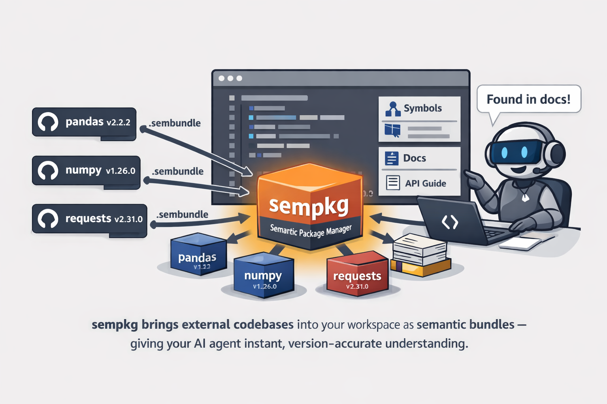

# sempkg

**The missing piece between your AI agent and the code it needs to understand.**

`sempkg` combines the power of [CodeGraph](https://github.com/colbymchenry/codegraph) symbol graphs and [QMD](https://github.com/tobi/qmd)-like documentation indexes into a single Rust binary that doubles as an MCP server — giving GitHub Copilot and other agents instant, structured access to any codebase's semantic intelligence.



## The version-drift problem — solved

AI agents routinely hallucinate APIs, reference removed methods, or cite docs for the wrong library version. `sempkg` fixes this at the source: dependencies are declared in a `sempkg.toml` manifest pinned to the **exact version you ship**, and the corresponding `.sembundle` index is fetched from a registry and served directly to your agent. Your agent reads the right symbols, the right signatures, and the right docs — for your versions, not someone else's.

## What you get

- **Symbol search & call graphs** — query function definitions, callers, and callees across indexed codebases without reading source files
- **Semantic doc search** — vector-search over embedded documentation, scoped to the pinned version
- **Version-pinned bundles** — install prebuilt indexes for your exact dependency versions; no drift, no guessing
- **Flexible index scoping** — indexes are globally available by default, or scoped to workspaces for maximum agent precision. Workspace-scoped indexes enable pinned semantic indexes tailored to each project's exact dependency graph, ensuring agents access the right APIs for the right context
- **Zero runtime overhead** — single self-contained binary, no Python, no Node, no manual context management
- **Self-hostable registry** — publish and serve your own `.sembundle` archives via `sempkg-registry`

---

## Components

| Component | Language | Description |
|-----------|----------|-------------|
| [`sempkg`](src/sempkg/) | Rust | CLI + MCP server: installs bundles, queries CodeGraph indexes, serves MCP tools |
| [`sembundle`](src/sembundle/) | Rust | CLI: packs, signs, and publishes `.sembundle` archives |
| [`sempkg-registry`](src/sempkg_registry/) | Python | Self-hosted FastAPI server for storing and serving `.sembundle` files |

---

## Installation

### Pre-built binaries (recommended)

**Linux / macOS:**
```sh
curl -fsSL https://raw.githubusercontent.com/willem445/sempkg/main/install.sh | sh
```

**Windows (PowerShell):**
```powershell
irm https://raw.githubusercontent.com/willem445/sempkg/main/install.ps1 | iex
```

Both scripts install `sembundle` and `sempkg` to `~/.local/bin` (Linux/macOS) or `%USERPROFILE%\.local\bin` (Windows). The PowerShell script automatically adds the directory to your user `PATH`.

**Options** (pass after `--` for sh, as flags for ps1):

| Flag | Description |
|------|-------------|
| `--only sembundle` / `-Only sembundle` | Install only `sembundle` |
| `--only sempkg` / `-Only sempkg` | Install only `sempkg` |
| `--version v1.2.0` / `-Version v1.2.0` | Pin a specific release tag |
| `--dir /custom/path` / `-InstallDir C:\path` | Override install directory |

### Build from source

Requires the [Rust toolchain](https://rustup.rs) and a C/C++ compiler (MSVC on Windows, Xcode CLT on macOS, `cmake`+`clang` on Linux).

```sh
cargo install --path src/sembundle
cargo install --path src/sempkg
```

---

## Quick Start

### Configure VS Code (workspace)

### Configure VS Code (workspace)

Add to `.vscode/mcp.json`:

```json
{
  "servers": {
    "sempkg": {
      "type": "stdio",
      "command": "sempkg",
      "args": ["mcp", "-C", "${workspaceFolder}"]
    }
  }
}
```

### Install a bundle

```powershell
# Initialise a sempkg.toml in your project
sempkg init --registry https://your-registry.example.com

# Add a dependency and install
sempkg add my-sdk@1.2.0
sempkg add pkg@4.6.1 --url https://github.com/org/repo/releases/download/pkg-v4.6.1/pkg-v4.6.1.sembundle
sempkg sync

# Add & index a dependency directly from Github (bypass index)
sempkg add https://github.com/pandas-dev/pandas/releases/tag/v3.0.3 --full
```

### GitHub authentication (private / enterprise)

When using private repositories or restricted GitHub hosts (GitHub Enterprise),
set a token environment variable before running `sempkg add`.

For host `github.company.com`, sempkg checks variables in this order:

1. `GITHUB_TOKEN_GITHUB_COMPANY_COM`
2. `GH_TOKEN_GITHUB_COMPANY_COM`
3. `GITHUB_ENTERPRISE_TOKEN`
4. `GH_ENTERPRISE_TOKEN`
5. `GITHUB_TOKEN`
6. `GH_TOKEN`

Use host-specific variables when possible to avoid mixing public GitHub and
enterprise credentials.

```powershell
$env:GITHUB_TOKEN_GITHUB_COMPANY_COM = "<your-enterprise-pat>"
sempkg add https://github.company.com/org/repo/releases/tag/v3.0.3 --full
```

---

## Documentation

- [sempkg User Guide](docs/sempkg.md) — CLI reference, MCP tools, workspace setup
- [SemBundle Format Specification](docs/sembundle-spec.md) — `.sembundle` archive format
- [Registry Server Guide](docs/registry-server.md) — self-hosting the bundle registry
- [ADR-001: LanceDB Documentation Index](docs/adr-001-lancedb-doc-index.md)
- [Vision & Roadmap](docs/vision-roadmap.md)

---

## Prerequisites

| Requirement | Notes |
|-------------|-------|
| [CodeGraph](https://github.com/colbymchenry/codegraph) | Must be on `PATH`. Install with `npm install -g @colbymchenry/codegraph`. |
| Rust toolchain | Required only when building `sempkg` and `sembundle` from source. Not needed when using the install scripts. |
| Python 3.11+ | Required only for `sempkg-registry`. |

---

## Development preferences

- Use `uv` for Python dependency management.
- See each component's `DEV-GUIDE.md` for build and test instructions.
