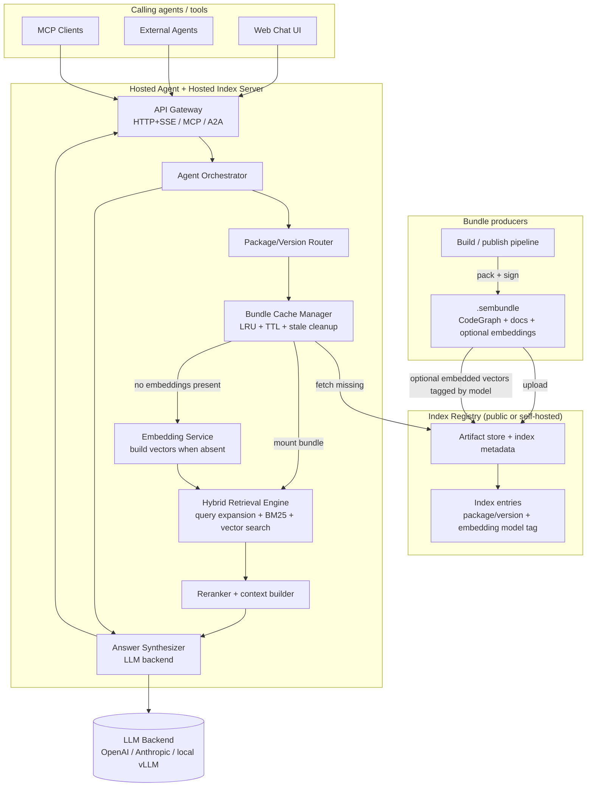
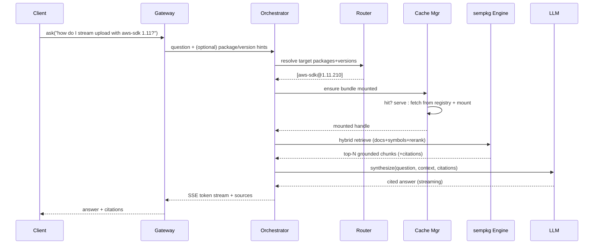

# Vision & Implementation Plan — sempkg Knowledge Agent Server

**Status:** Draft / Proposal
**Date:** 2026-06-19
**Owner:** TBD
**Related:** [registry-server.md](registry-server.md), [roadmap/vision-roadmap.md](roadmap/vision-roadmap.md), [design/reranker-design.md](design/reranker-design.md), [sembundle-spec.md](sembundle-spec.md)

---

## 1. Vision

Today the registry is a *passive artifact store*: it holds `.sembundle` archives and serves
them to clients who then run their own queries locally via the `sempkg` MCP server.

The vision is to evolve the registry into an **active knowledge service** — a hosted
"ask-me-anything" endpoint over a large corpus of popular packages. Instead of every agent
downloading and querying bundles itself, an agent (or a human via chat UI) can ask a general
natural-language question such as:

> *"How do I stream a multipart upload with the AWS SDK for Rust v1.11, and what happens if the
> connection drops mid-upload?"*

and the server answers it by:

1. Selecting the relevant package(s) and version(s) from the corpus.
2. Pulling precise, version-pinned context out of the corresponding `.sembundle` indexes
   (CodeGraph symbol graph + LanceDB docs/code BM25 + reranker) using the existing `sempkg`
   query engine.
3. Feeding that grounded context to an LLM backend that composes a cited answer.

This makes sempkg the **grounded retrieval layer for a code-intelligence RAG service** — the
"no hallucination, version-accurate" counterpart to general coding assistants.

### Goals

- A **public or self-hosted agent endpoint** reachable three ways:
  - **HTTP/JSON + SSE** chat API (and a thin web chat UI).
  - **MCP server** (so other agents can mount it as a tool over the network).
  - **A2A** (Agent-to-Agent) task interface for multi-agent orchestration.
- **Grounded answers** — every claim traceable to a symbol, file, or doc chunk in a specific
  bundle version. No ungrounded generation.
- **Version accuracy** — answers are pinned to an explicit package version, never blended
  across versions.
- **Large corpus** — index thousands of popular packages across ecosystems.
- **Hot/cold tiering** — keep recently-requested bundles "mounted" for fast retrieval; evict
  cold bundles to reclaim disk.

### Non-Goals (initial)

- Replacing the artifact registry — the agent server is *layered on top* of it.
- Full agentic code editing / patch generation (retrieval + Q&A first).
- Training or fine-tuning custom models (use off-the-shelf LLM backends).

---

## 2. Current State (what we build on)

| Component | Language | Role today |
|---|---|---|
| `sempkg_registry` | Python / FastAPI | Stores & serves `.sembundle` archives, `index.json`, token auth, Ed25519 signing. |
| `sempkg` | Rust | CLI + MCP server. Installs bundles, serves CodeGraph + LanceDB queries, optional local reranker. |
| `sembundle` | Rust | Packs / signs / validates / publishes bundles. |

Key existing capabilities we reuse directly:

- **Retrieval tools** already implemented in `sempkg` MCP (`mcp.rs`): `search_symbols`,
  `get_context`, `get_callers`, `get_callees`, `get_impact`, `list_files`, `search_docs`,
  `search_code`, `docs_metadata`, `list_packages`.
- **Hybrid retrieval + reranking** — LanceDB BM25 unioned with CodeGraph symbol search,
  optionally reranked by a local Qwen3-Reranker GGUF (`reranker.rs`).
- **Registry index format** — `index.json` enumerates packages, versions, SHA-256, signing.
- **Bundle install/verify pipeline** — SHA-256 + Ed25519 trust model.

The gap to close: there is **no orchestration layer** that (a) routes a question to the right
bundle(s), (b) calls the retrieval engine programmatically (not just over stdio MCP), (c)
synthesizes an answer with an LLM, and (d) manages a hot cache of mounted bundles.

---

## 3. Proposed Architecture

### 3.1 High-level



This hosted layout keeps the registry as the durable source of truth while moving the expensive
question-answering work onto compute that can stay warm. Bundles may arrive with embeddings
already baked in and tagged with the embedding model, or the hosted service can generate the
missing vectors on demand before running the full retrieval pipeline.

### 3.2 Request lifecycle (RAG over bundles)



### 3.3 Component responsibilities

- **API Gateway** — terminates the three protocols (HTTP/SSE chat, network MCP, A2A) and
  normalizes them into one internal "ask" request. Handles auth, rate limiting, request size.
- **Agent Orchestrator** — the RAG/agent loop. Decides whether to do single-shot retrieval or a
  multi-step tool-calling loop (let the LLM call retrieval tools iteratively). Owns prompt
  templates and citation assembly.
- **Package/Version Router** — maps a free-text question to concrete `package@version` targets.
  Uses (a) explicit hints from the caller, (b) lexical match against the registry index, and (c)
  an embedding index over package descriptions/READMEs for fuzzy "which package does X" routing.
  Defaults to `latest` when version is unspecified.
- **Retrieval Service** — programmatic wrapper around the existing `sempkg` query engine. This is
  the key new integration point (see §4).
- **Answer Synthesizer** — pluggable LLM backend behind a provider-agnostic interface. Builds the
  grounded prompt, enforces "cite or abstain," streams tokens.
- **Bundle Cache Manager** — hot/cold tiering of mounted bundles with LRU + TTL eviction and a
  disk-usage watermark. Backed by the registry as the cold source of truth.

---

## 4. Integrating the sempkg retrieval engine

The retrieval tools live in Rust (`sempkg`). The registry/agent server is Python. Three options:

| Option | How | Pros | Cons | Recommendation |
|---|---|---|---|---|
| **A. Network MCP** | Run `sempkg mcp` exposed over a network transport; agent server is an MCP client. | Reuses existing tool surface as-is; clean process isolation. | Needs network MCP transport (today it's stdio); per-request process model. | Good for v1 if we add an HTTP/streamable-MCP transport to `sempkg`. |
| **B. `sempkg serve` HTTP API** | Add a thin Axum HTTP service to `sempkg` exposing the same tools as REST/JSON. | High throughput, multi-bundle in one process, language-agnostic. | New surface to build/maintain in `sempkg`. | **Recommended** — best perf + clean contract. |
| **C. PyO3 bindings** | Compile `sempkg` retrieval as a Python extension module. | In-process, no IPC. | Tight coupling; build complexity; GIL/threading concerns with llama.cpp. | Later optimization only. |

**Recommended path:** Option **B** — add a long-lived `sempkg serve` mode (Axum) that:

- Accepts `(package, version, query, mode, top_k, rerank)` requests.
- Holds multiple bundles mounted concurrently (the cache manager controls mount/unmount).
- Returns structured, citation-ready results (symbol/file/line/doc-chunk + score).
- Optionally exposes the same tools as a **network MCP** endpoint (Option A) for free, since the
  internal handlers are shared.

This keeps the heavy retrieval + reranking in Rust where it already works, and gives the Python
orchestration layer a clean, fast contract.

---

## 5. Bundle cache (hot/cold) design

- **Tiers:**
  - **Hot** — bundle extracted/mounted, LanceDB + CodeGraph open, ready to query.
  - **Warm** — `.sembundle` present on local disk but not mounted.
  - **Cold** — only in the registry/object store.
- **Admission:** on a request for `package@version`, the cache manager resolves Hot → Warm →
  Cold, fetching and mounting as needed.
- **Eviction:** LRU by last-access, with:
  - a **disk watermark** (e.g. evict to 70% when usage exceeds 85%),
  - a **TTL** for idle bundles (e.g. unmount after N minutes idle, delete after M hours),
  - **pinning** for an always-hot "top-K most popular packages" set.
- **Concurrency:** mount/unmount guarded so in-flight queries keep a bundle alive (refcount +
  idle timer). Eviction never unmounts a bundle with active readers.
- **Integrity:** reuse the existing SHA-256 + Ed25519 verification on fetch from registry before
  mounting — the agent server must not serve answers from an unverified bundle.
- **Metrics:** per-bundle hit rate, mount latency, eviction count, disk usage — exported for
  autoscaling and capacity planning.

---

## 6. Recommended frameworks & stack

Chosen to favor mature, widely-adopted, well-supported tooling.

| Concern | Recommendation | Why |
|---|---|---|
| Web API / gateway | **FastAPI** (extend existing service) | Already in repo; async; great SSE/streaming support. |
| Agent orchestration | **LangGraph** (or **Pydantic AI** for a lighter touch) | Explicit, debuggable state-machine agent loops; first-class tool calling, streaming, retries. Pydantic AI is a smaller dependency if a full graph is overkill. |
| LLM provider abstraction | **LiteLLM** | One interface over OpenAI, Anthropic, Azure, Bedrock, local vLLM/Ollama. Avoids vendor lock-in; the user can run public (hosted) or self-hosted models. |
| Self-hosted inference | **vLLM** (server) / **Ollama** (dev) | vLLM for throughput in production; Ollama for laptop/self-host. Both speak OpenAI-compatible APIs via LiteLLM. |
| Retrieval engine | **existing `sempkg` Rust engine** via `sempkg serve` (Axum) | Reuse what already works; keep reranking in Rust. |
| Package routing index | **LanceDB** (package-level embeddings) | Already a dependency in the ecosystem; one store for "which package" routing. |
| Embeddings (routing) | **BGE / E5 via a small local embed server**, or provider embeddings through LiteLLM | Cheap fuzzy routing; local option keeps it self-hostable. |
| MCP exposure | **Official Python `mcp` SDK** (streamable HTTP transport) | Standard way to expose the endpoint to other agents. |
| A2A | **A2A protocol** task server (Agent Card + task endpoints) | Emerging standard for agent-to-agent; expose the same "ask" capability as an A2A skill. |
| Caching/state | **Redis** (hot metadata, rate limits, sessions) + local disk for bundles | Standard, simple, horizontally scalable. |
| Object store (bundles) | **S3-compatible (MinIO self-host / S3 cloud)** | Scales the cold tier beyond one box's disk. |
| Observability | **OpenTelemetry + Langfuse** (LLM tracing) | Trace retrieval + generation; measure grounding quality and cost. |
| Eval | **Ragas** (or **promptfoo**) on a curated Q&A set | Guard against regressions in answer grounding/accuracy. |
| Deployment | **Docker + Compose** (self-host) → **Kubernetes** (public scale) | Compose mirrors the existing Dockerfile; K8s for the public tier. |

### Why this shape

- **Keep retrieval in Rust, orchestration in Python.** The Rust engine is fast and already
  handles reranking; Python has the richest agent/LLM ecosystem. A clean HTTP contract between
  them avoids rewrites.
- **Provider-agnostic LLM** so the *same* server runs against a hosted API (public deployment) or
  a local vLLM/Ollama (air-gapped self-host) with only config changes.
- **One capability, three transports.** The orchestrator implements "ask" once; the gateway
  adapts it to chat HTTP, MCP, and A2A so we don't fork logic per protocol.

---

## 7. API surface (proposed)

New endpoints on the agent server (separate service or new router in `sempkg_registry`):

- `POST /v1/ask` — `{question, packages?, version?, stream?}` → cited answer (SSE when `stream`).
- `POST /v1/chat` — multi-turn conversation with session id; same grounding guarantees.
- `GET  /v1/sources/{id}` — fetch the raw cited chunk/symbol for transparency.
- `GET  /v1/packages` — searchable corpus catalog (proxied/derived from registry `index.json`).
- `GET  /healthz`, `GET /metrics` — ops.
- **MCP**: a network MCP server exposing an `ask` tool (and optionally the raw retrieval tools).
- **A2A**: an Agent Card advertising an `answer_package_question` skill + task endpoints.

Answer payload always includes a `citations[]` array: `{package, version, kind, path, lines,
score, snippet}`.

---

## 8. Grounding & safety

- **Cite-or-abstain prompt contract** — the synthesizer must answer only from retrieved context
  and explicitly say when the corpus lacks the answer.
- **Version isolation** — never mix chunks from different versions of the same package in one
  answer unless the question is explicitly comparative.
- **Bundle verification before serve** — SHA-256 + signature checks (existing trust model) gate
  what may be mounted.
- **Prompt-injection hardening** — treat doc/code content as untrusted data, not instructions;
  keep retrieved text in a clearly delimited context region.
- **Rate limiting & quotas** — per-token limits at the gateway (reuse/extend the token store).
- **Cost controls** — max context tokens, max retrieval rounds, model tier per token class.
- **PII/logging** — log questions/answers behind a privacy flag; redact for the public tier.

---

## 9. Phased implementation plan

### Phase 0 — Spike (prove the loop)
- Manual script: question → pick one known bundle → call existing `sempkg` retrieval over stdio
  MCP → stuff context into one LLM call → printed cited answer.
- **Exit:** end-to-end grounded answer for 3 sample packages.

### Phase 1 — Retrieval service contract
- Add `sempkg serve` (Axum) exposing the retrieval tools as HTTP/JSON, multi-bundle, structured
  citations. Optionally expose network MCP from the same handlers.
- **Exit:** Python client can query any mounted bundle via HTTP and get citation-ready results.

### Phase 2 — Orchestrator + LLM synthesis
- FastAPI `POST /v1/ask` (non-streaming then SSE). LangGraph/Pydantic AI loop. LiteLLM provider
  abstraction. Cite-or-abstain prompt + citation assembly.
- **Exit:** `/v1/ask` returns grounded, cited answers against a fixed small corpus.

### Phase 3 — Package/version router
- Lexical match over `index.json` + LanceDB embedding index over package descriptions/READMEs.
  Version defaulting to `latest`; explicit-hint override.
- **Exit:** correct package/version selected for a labeled routing test set above a target accuracy.

### Phase 4 — Bundle cache manager
- Hot/Warm/Cold tiering, LRU + TTL + disk watermark, refcounted mounts, pinned top-K, integrity
  verification on fetch, metrics.
- **Exit:** server sustains a large corpus on bounded disk with measured hit-rate/latency.

### Phase 5 — Multi-protocol exposure
- Network MCP `ask` tool; A2A Agent Card + task endpoints; minimal web chat UI (streaming).
- **Exit:** an external MCP agent and an A2A agent both get answers; UI demos chat.

### Phase 6 — Corpus build pipeline
- Automated mass-indexing: pick top-N popular packages per ecosystem, build/sign/publish bundles
  (extend `sembundle` + CI). Scheduled refresh for new releases.
- **Exit:** thousands of packages indexed and auto-updated.

### Phase 7 — Hardening & ops
- Eval harness (Ragas/promptfoo) in CI, OpenTelemetry + Langfuse tracing, rate limits/quotas,
  autoscaling, public-tier abuse protections.
- **Exit:** SLOs for latency, grounding accuracy, and cost; ready for public/self-host release.

---

## 10. Open questions / decisions to make

1. **Service boundary:** new standalone `sempkg_agent` service, or new routers inside
   `sempkg_registry`? (Leaning standalone for independent scaling.)
2. **Rust integration:** confirm Option B (`sempkg serve`) vs network MCP for v1.
3. **Default models:** which hosted default (public tier) and which local default (self-host)?
4. **Routing quality bar:** acceptable package/version selection accuracy before GA.
5. **Corpus scope & licensing:** which ecosystems first; license/ToS review for mass indexing of
   third-party docs/source.
6. **Multi-tenancy:** is the public endpoint anonymous, token-gated, or both tiers?
7. **Comparative queries:** support cross-version diffs (e.g. "what changed between 1.10 and
   1.11")? This needs multi-bundle retrieval + a diff-aware prompt.

---

## 11. Risks

- **Hallucination despite grounding** — mitigate with cite-or-abstain + eval harness in CI.
- **Cost blowups** — bound context/tokens/rounds; cache aggressively; cheaper model tiers.
- **Cold-start latency** — pin popular bundles hot; pre-warm on deploy from access stats.
- **Corpus staleness** — scheduled re-index on new releases; surface bundle build date in answers.
- **Cross-language build friction** (Rust↔Python) — keep the HTTP contract narrow and versioned.
- **Legal/licensing** for indexing third-party content — review before public corpus launch.
```

